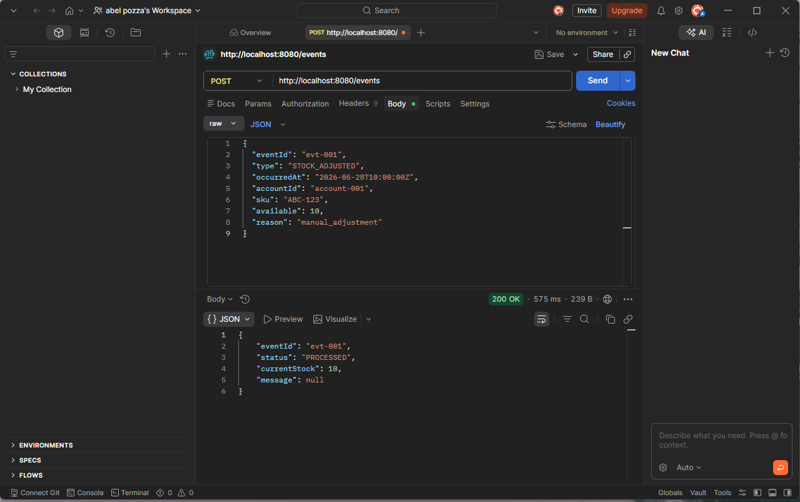
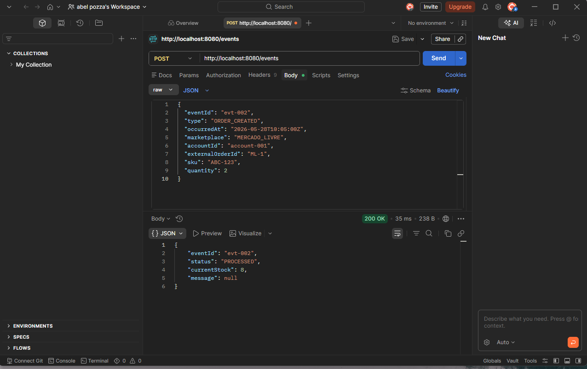
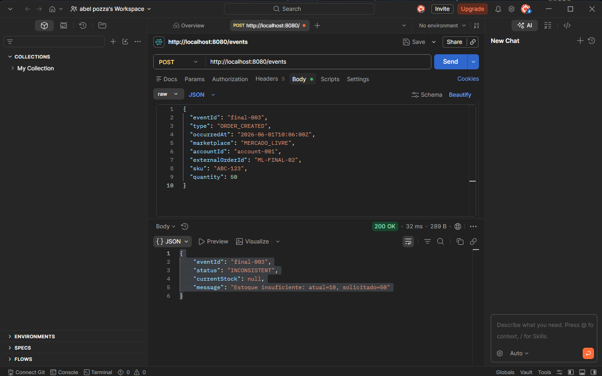
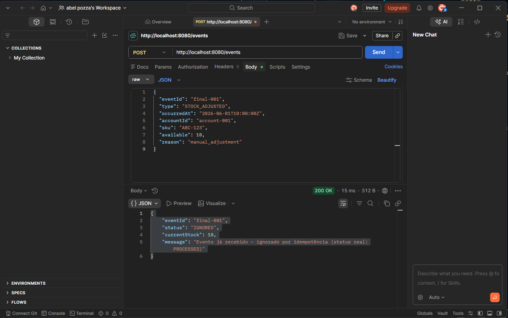
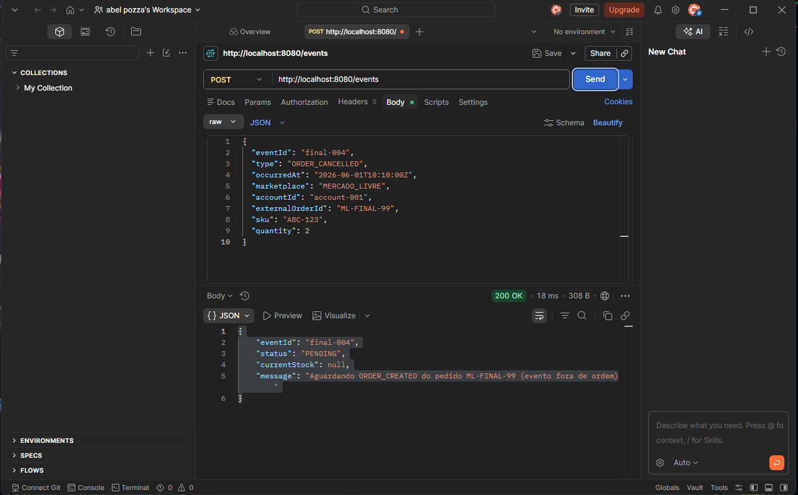
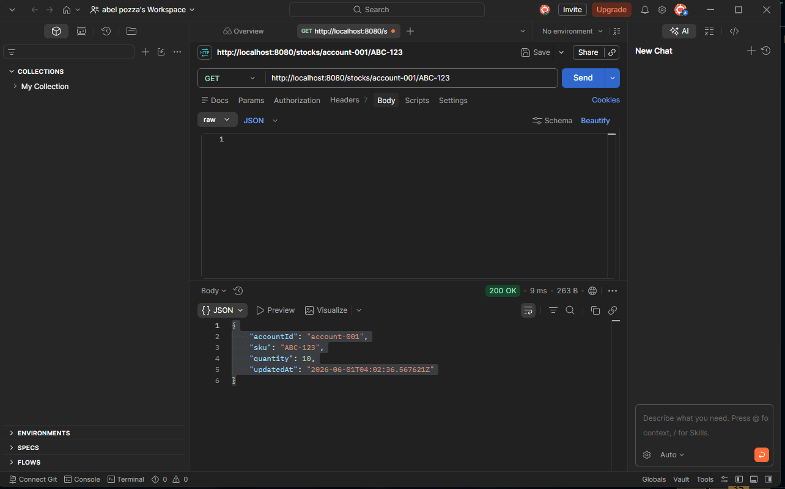
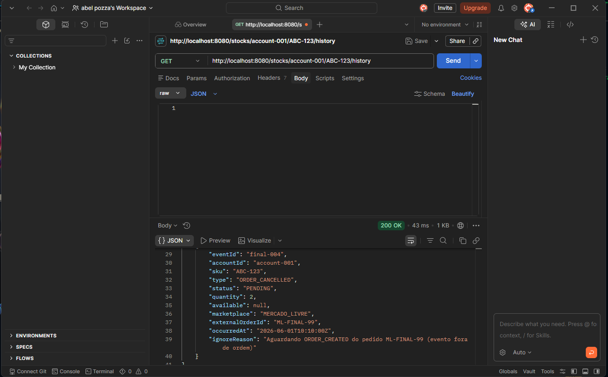
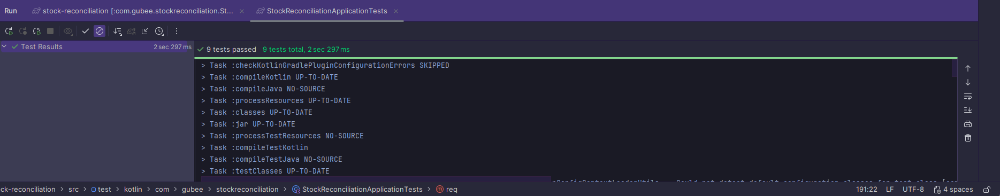

# gubee-stock-reconciliation

Serviço de reconciliação de estoque para integração com marketplaces.
Recebe eventos de estoque e pedidos, mantém o saldo atual por conta/SKU
e permite auditoria completa das alterações.

## Tecnologias

- Kotlin + Spring Boot 4
- PostgreSQL 16
- Flyway (migrations)
- Docker Compose
- Swagger/OpenAPI (springdoc)

## Como rodar

### Pré-requisitos
- Docker Desktop instalado e rodando
- JDK 21

### Subindo o banco

```bash
docker compose up -d postgres
```

### Rodando a aplicação

```bash
./gradlew bootRun
```

A aplicação sobe em `http://localhost:8080`.

### Rodando via Docker Compose completo

```bash
docker compose up --build
```

Sobe o banco e a aplicação juntos.

## Endpoints

| Método | Endpoint | Descrição |
|--------|----------|-----------|
| POST | `/events` | Recebe e processa um evento |
| GET | `/events?status=` | Lista eventos por status |
| GET | `/stocks/{accountId}/{sku}` | Retorna o saldo atual |
| GET | `/stocks/{accountId}/{sku}/history` | Retorna o histórico de alterações |

## Documentação interativa

Com a aplicação rodando, acesse:

```
http://localhost:8080/swagger-ui/index.html
```

## Exemplos de requisição

### Ajuste de estoque
```json
POST /events
{
  "eventId": "evt-001",
  "type": "STOCK_ADJUSTED",
  "occurredAt": "2026-05-28T10:00:00Z",
  "accountId": "account-001",
  "sku": "ABC-123",
  "available": 10,
  "reason": "manual_adjustment"
}
```

### Pedido criado
```json
POST /events
{
  "eventId": "evt-002",
  "type": "ORDER_CREATED",
  "occurredAt": "2026-05-28T10:05:00Z",
  "marketplace": "MERCADO_LIVRE",
  "accountId": "account-001",
  "externalOrderId": "ML-123456",
  "sku": "ABC-123",
  "quantity": 2
}
```

### Pedido cancelado
```json
POST /events
{
  "eventId": "evt-003",
  "type": "ORDER_CANCELLED",
  "occurredAt": "2026-05-28T10:10:00Z",
  "marketplace": "MERCADO_LIVRE",
  "accountId": "account-001",
  "externalOrderId": "ML-123456",
  "sku": "ABC-123",
  "quantity": 2
}
```

## Exemplos de uso

### Ajuste de estoque


### Venda baixando estoque


### Estoque insuficiente


### Idempotência — evento já recebido


### Evento fora de ordem — PENDING


### Consulta de saldo


### Consulta de histórico


## Como rodar os testes

```bash
./gradlew test
```

Os testes cobrem 9 cenários: ajuste de estoque, venda, cancelamento, idempotência,
estoque insuficiente, eventos fora de ordem, duplicidade lógica, concorrência e
recomposição do marketplace.

> O banco precisa estar rodando antes de executar os testes:
> `docker compose up -d postgres`

### Resultado dos testes


## Limitações conhecidas

- Os testes dependem do PostgreSQL do Docker Compose (sem Testcontainers)
- O reprocessamento de eventos `PENDING` tem latência de até 30 segundos
- Sem autenticação nos endpoints
- Sem Kafka — eventos chegam via REST síncrono (justificado no DECISIONS.md)